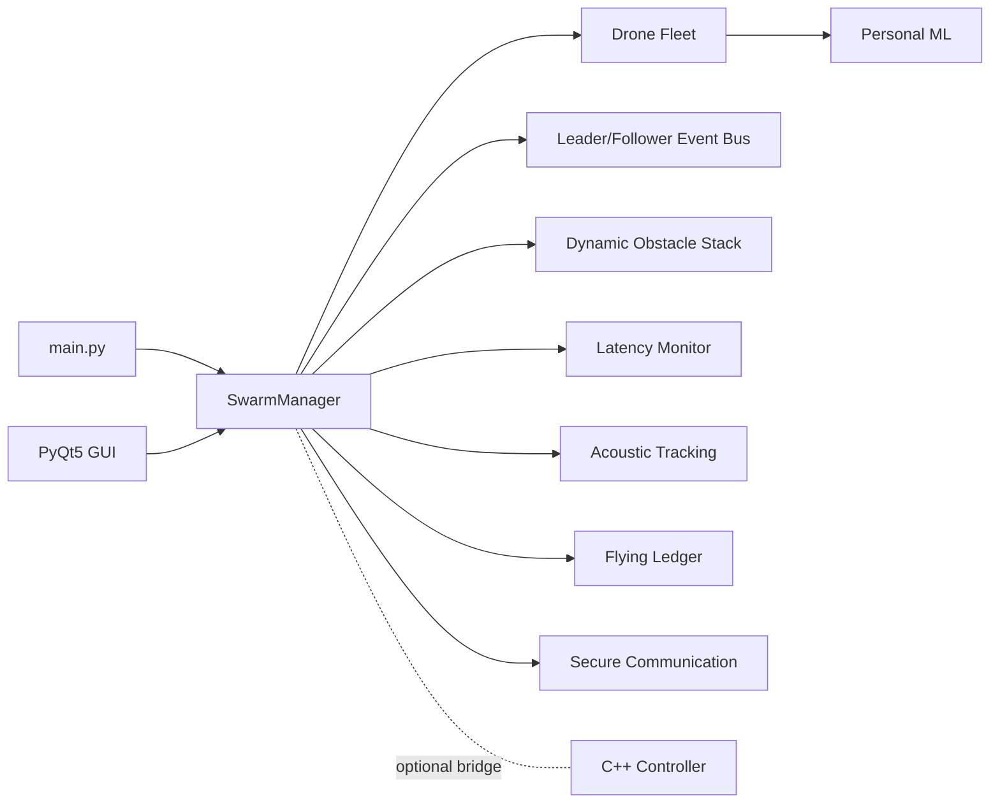
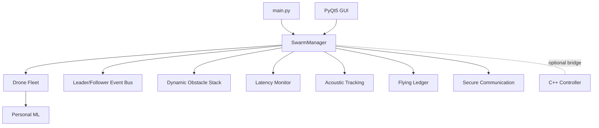

<!--
#########################################################################
#                                                                       #
#   SECURE DRONE SWARM SYSTEM - CORE MODULE                             #
#                                                                       #
#   Developer : Md Shahanur Islam Shagor                                #
#   Role      : Project Architect & Lead Developer                      #
#   Version   : 1.0.2                                                   #
#   Status    : Production Ready                                        #
#                                                                       #
#   "Protecting the skies with decentralized intelligence."             #
#                                                                       #
#########################################################################
-->

# Project Overview

## Decentralized Coordination and Acoustic Localization in Secure Autonomous Drone Swarms

This project implements a secure, fault-tolerant multi-drone swarm platform that combines decentralized coordination, dynamic obstacle avoidance, acoustic source localization, and runtime safety fallback.

## 1. Objectives

- Coordinate multiple drones with automatic leader election and follower synchronization
- Maintain mission continuity under failures (leader crash, motor degradation, latency spikes)
- Secure communication and event replication across the swarm
- Support operation in vision-impaired/GPS-limited scenarios using acoustic localization
- Provide an operator-facing GUI for mission control and monitoring

## 2. Core Capabilities

- Leader/follower command flow with event-driven orchestration
- Dynamic obstacle prediction and avoidance:
  - trajectory forecasting
  - collision probability
  - collision-cone risk estimation
  - acceleration-limited velocity blending
- Latency monitoring with watchdog and fallback local avoidance mode
- Acoustic TDOA localization with GCC-PHAT-based delay estimation
- Decentralized flying ledger using SHA3-256 hashing and Ed25519 signatures
- Optional C++ low-level controller with motor health self-healing logic

### Architecture Diagram



### Architecture Diagram (Vertical Variant)



## 3. System Components

Primary modules:
- `main.py`: entrypoint and runtime bootstrap
- `swarm_manager.py`: orchestration, mission flow, role/state transitions
- `drone.py`: per-drone flight behavior, RTH, emergency logic
- `leader_follower_logic.py`: event bus and command handling
- `dynamic_obstacles.py`: dynamic prediction + rerouting controls
- `latency_monitor.py`: RTT/jitter tracking and fallback decisions
- `acoustic_tracking.py`: cross-correlation, TDOA, least-squares fusion
- `communication.py`: encrypted communication channel
- `flying_ledger.py`: signed append-only distributed ledger
- `ml_system.py`: personal ML decision support
- `gui.py`: PyQt5 control and visualization interface
- `dronecontroller.cpp`, `dronecontroller.h`: optional native low-level layer

## 4. Operational Flow

1. Swarm initializes and leader is elected.
2. Leader issues mission commands through event-driven handlers.
3. Drones execute movement and continuously evaluate:
   - obstacle risk
   - latency/jitter
   - motor health
   - battery and mission state
4. If unsafe latency is detected, fallback local avoidance activates.
5. Acoustic events can trigger TDOA localization and swarm response.
6. Critical events are logged and replicated via the flying ledger.

## 5. Safety and Reliability Strategy

- Adaptive latency thresholds and watchdog timeout checks
- Degraded and emergency return-to-home behavior
- Emergency landing pathways
- Motor degradation detection and thrust compensation (native controller path)
- Encrypted inter-drone communication and integrity-preserving event replication

## 6. Developer Workflow Summary

Setup:

```bash
python -m venv venv
```

Windows:

```bash
venv\Scripts\activate
```

Linux/macOS:

```bash
source venv/bin/activate
```

Install:

```bash
pip install --upgrade pip
pip install -r requirements.txt
```

Run:

```bash
python main.py
```

Test:

```bash
python main.py --test
python -m unittest test_dynamic_features.py
```

## 7. Documentation Map

- `readme.md`: full architecture, math model, module descriptions, diagrams
- `deployment_guide.md`: developer deployment and real-drone operational guide
- `CONTRIBUTING.md`: contribution workflow, standards, PR requirements

## 8. Current Status

- Simulation-first workflow is fully supported.
- Real-drone mode is available through environment-based configuration.
- Documentation has been aligned for developer onboarding, deployment, and contribution processes.
