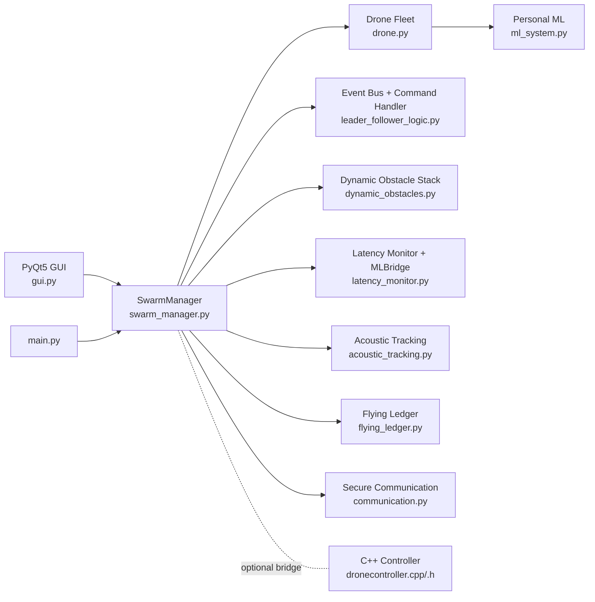
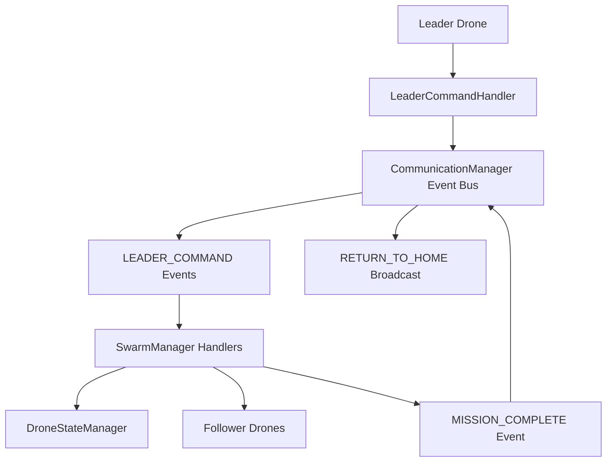
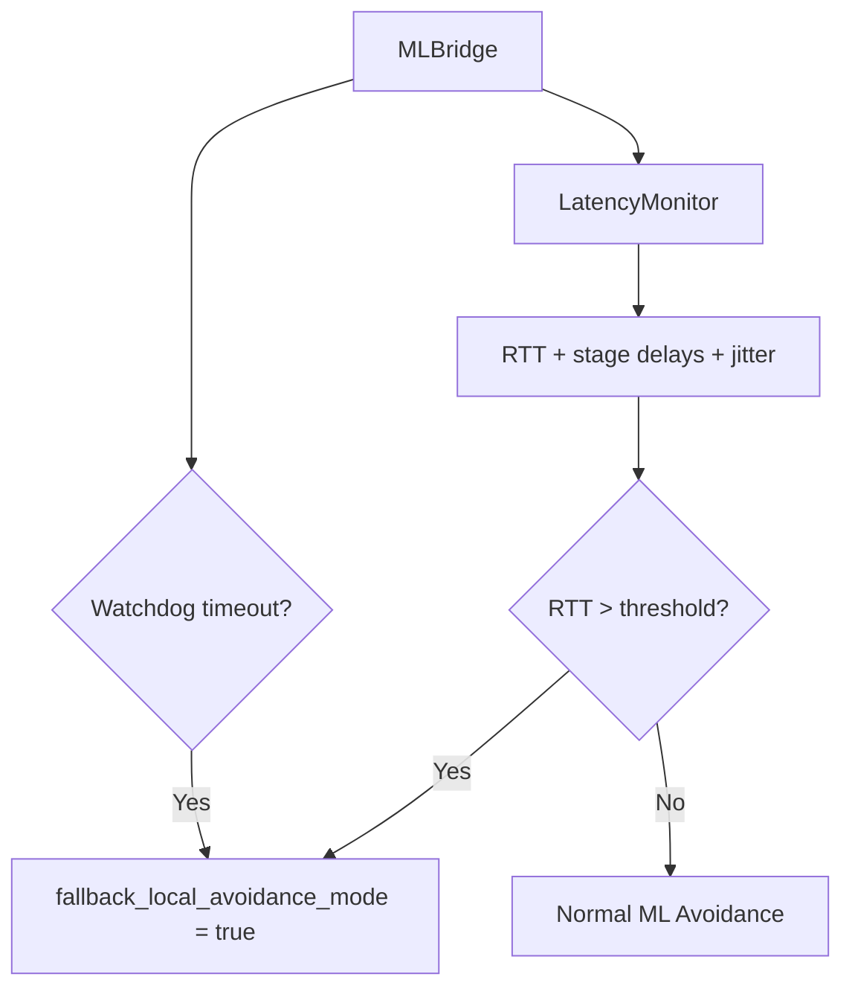
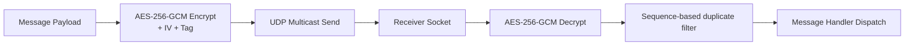
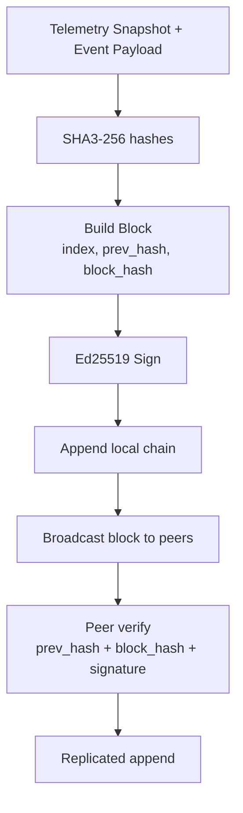
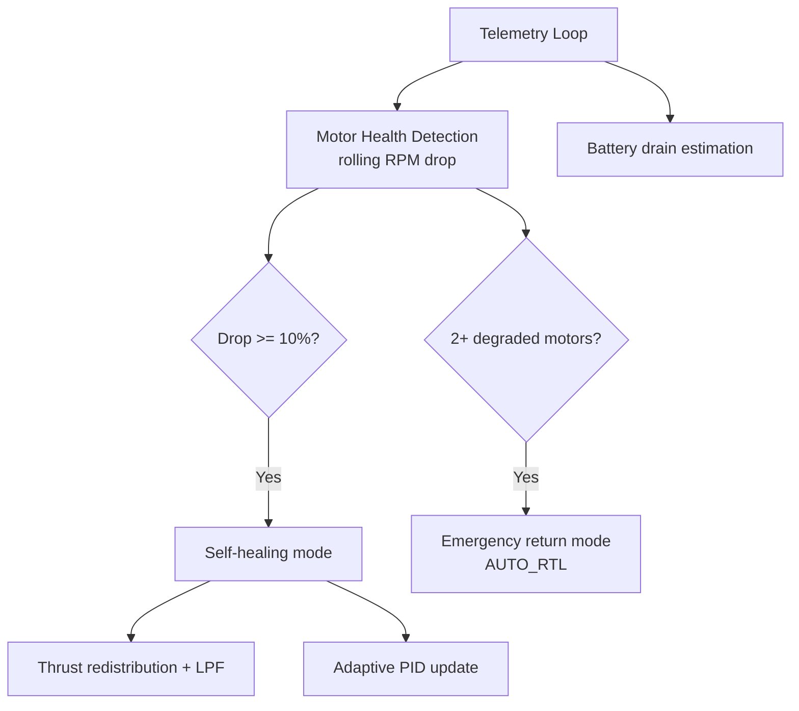
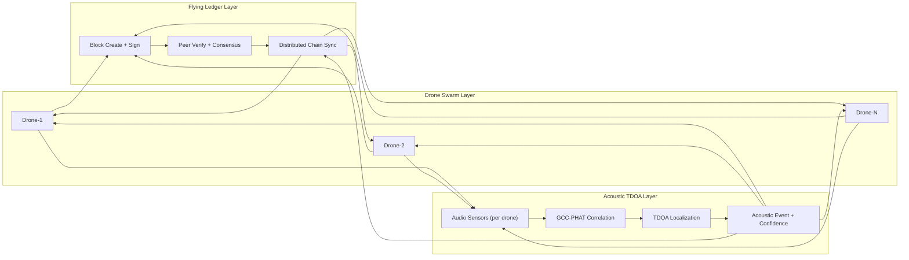
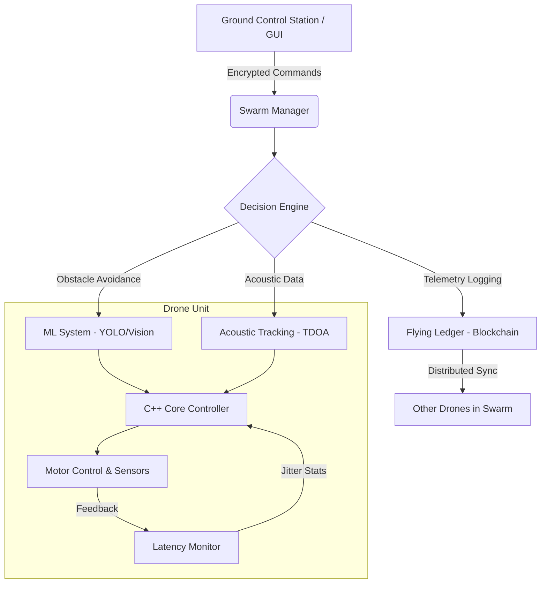

# Decentralized Coordination and Acoustic Localization in Secure Autonomous Drone Swarms

End-to-end multi-drone swarm platform combining decentralized coordination, dynamic obstacle avoidance, secure communication, acoustic source localization, latency-aware safety fallback, and a PyQt5 operator GUI.

## 1. What This Project Implements

- Multi-drone swarm orchestration with automatic leader election
- Event-driven leader/follower command flow
- Personal ML + geometric fallback for dynamic obstacle avoidance
- AES-GCM encrypted drone communication channel
- Per-drone append-only flying ledger with Ed25519 signatures
- Acoustic source localization using TDOA + least-squares fusion
- C++ low-level controller with motor fault self-healing logic
- Runtime latency monitoring with jitter and watchdog safety fallback

## 2. Architecture Diagrams

### 2.1 System-Level Architecture



### 2.2 Coordination and Command System



### 2.3 Dynamic Obstacle Avoidance System

```mermaid
flowchart TD
    OBS[ObstacleManager] --> TRK[ObstacleTracker\nlinear/circular/random-walk]
    TRK --> PRED[TrajectoryEstimator]
    PRED --> RISK[DynamicObstaclePredictor\ncollision + cone probability]
    RISK --> AVOID[AvoidanceController\nvelocity blend + accel limit]
    AVOID --> REPLAN[PathReplanner]
    REPLAN --> GOTO[drone.goto(safe_target)]

    LATMODE[Fallback Local Avoidance Mode] --> AVOID
```

### 2.4 Latency and Safety Fallback System



### 2.5 Acoustic Localization System

```mermaid
flowchart TD
    SIG[Multi-drone audio signals] --> XCORR[CrossCorrelationEngine\nGCC-PHAT + FFT corr]
    XCORR --> TDOA[TDOAEstimator\ndelay per sensor]
    TDOA --> FUSE[AcousticFusionEngine\nleast_squares]
    FUSE --> SRC[Source XY + RMSE + Confidence]

    LAT[Current RTT] --> GATE{RTT > acoustic_latency_limit?}
    GATE -->|Yes| LOCAL[Local-only (first 3 sensors)]
    GATE -->|No| GLOBAL[Use full sensor set]
    LOCAL --> FUSE
    GLOBAL --> FUSE
```

### 2.6 Secure Communication System



### 2.7 Flying Ledger System



### 2.8 C++ Low-Level and Immune Subsystem


### 2.9 Drone-Ledger-Acoustic Integration





## 3. Core Modules

- `main.py`: entrypoint, logging, swarm bootstrap, GUI start
- `swarm_manager.py`: central orchestration, event loop, mission logic
- `drone.py`: per-drone physics/state/mode handling
- `leader_follower_logic.py`: event bus, command handler, operational states
- `dynamic_obstacles.py`: obstacle motion, prediction, collision-cone, avoidance blending
- `latency_monitor.py`: RTT/jitter metrics + watchdog bridge
- `acoustic_tracking.py`: GCC-PHAT/correlation delay estimation + TDOA localization
- `communication.py`: AES-256-GCM encrypted communication
- `flying_ledger.py`: SHA3-256 hashed, Ed25519-signed replicated ledger
- `ml_system.py`: per-drone decision support for risk/path/formation
- `dronecontroller.h`, `dronecontroller.cpp`: C++ low-level control, telemetry, self-healing
- `gui.py`: full operator console

### Current Folder Structure

```text
secure-drone-swarm/
-- main.py
-- gui.py
-- swarm_manager.py
-- drone.py
-- leader_follower_logic.py
-- dynamic_obstacles.py
-- latency_monitor.py
-- communication.py
-- ml_system.py
-- ml_trainer.py
-- dronecontroller.h
-- dronecontroller.cpp
-- main_test.cpp
-- test_dynamic_features.py
-- requirements.txt
-- readme.md
-- performance_graphs/
    --csv/
        -- runtime_latency_vs_drones_YYYYMMDD_HHMMSS.csv
        -- latency_spike_timeline_YYYYMMDD_HHMMSS.csv
    --img/
        -- latency_timeseries_YYYYMMDD_HHMMSS.png
        -- latency_spike_timeline_YYYYMMDD_HHMMSS.png
    --logs/
        -- merged_logs_YYYYMMDD_HHMMSS.log
    -- auto_plot_from_csv.py
    -- latency_vs_drones.py
-- config/
    -- swarm_config.json
-- assets/
    -- drone.svg
    -- fields.svg
-- datasets/
    -- personal_training.csv
    -- personal_training.json
    -- personal_drone_1.csv
-- models/
-- logs/
-- build/
```

## 4. Full GUI Feature Description

`gui.py` contains the complete operator console. Major parts:

### 4.1 Visualization Tabs
- **Drone Visual**
  - Drone icons, labels, trails, heading markers
  - Home markers (`H<id>`)
  - Operation box/corners and X->Y plan overlay
  - Static + dynamic obstacle rendering
  - Dynamic obstacle pulse + motion trail + velocity direction line
- **Location Map**
  - 10km radius simplified map view
  - selected-drone highlighting

### 4.2 Controls Panel

#### Fleet Controls
- `Add Drone`
- `Remove Drone`

#### Flight Controls
- `Arm All`
- `Takeoff All`
- `Land All`
- `RTH All`
- `EMERGENCY LAND` (all)
- `EMERGENCY SELECTED` (single drone)
- `Leader Command X->Y`

#### Formation and Follow
- Formation: `line`, `v`, `circle`, `grid`
- Leader follow pattern: `v`, `line`
- Adjustable follow spacing

#### Fault/Stress Scenarios
- `Simulate Motor Failure`
- `Crash Leader`
- `Auto Fault Demo: ON/OFF`
- `Simulate Latency Spike`

#### Dynamic Obstacle Controls
- Add moving obstacle with:
  - start position (`x`, `y`)
  - velocity (`vx`, `vy`)
  - radius
  - motion type (`linear`, `circular`, `random_walk`)
- Add static obstacle
- Clear obstacles
- Toggle static visibility
- Toggle dynamic visibility
- Toggle `Use Personal ML Avoidance`

#### Selected Drone Manual Movement
- Up/Down/Left/Right/Hover buttons
- Keyboard shortcuts:
  - Arrow keys for movement
  - `Space`/`H` for hover

#### GPS Mission Panel (Selected or All)
- Reference GPS (`Ref Lat`, `Ref Lon`)
- Target GPS center (`Target Lat`, `Target Lon`)
- Mission radius
- Drone ID selector (`0 = All`)
- `Assign Mission`
- `Clear Mission`
- `Open Target in Google Maps`

### 4.3 Swarm Status Panel
- Total drones
- Active drones
- Leader ID
- Average battery
- Latency metrics:
  - C++->Py
  - Py processing
  - Py->C++
  - RTT
  - RTT jitter
- Drone table (always vertically scrollable):
  - ID, Role, Mode, Battery, Altitude, Status
- Drone table is fully dynamic in GUI:
  - defensive row updates, dynamic resizing, always-visible vertical scrollbar
  - smooth scrolling and sortable columns
- Latency indicators (`C++->Py`, `Py Proc`, `Py->C++`, `RTT`, `RTT Jitter`) are dynamically refreshed from runtime latency stats.

### 4.4 Logs Panel
- System log stream
- Encrypted command/message lines
- Encrypted D2D traffic tail
- Avoidance events with probability/cone/confidence
- Latency warning events


## 5. Core Operational Logic

## 5.1 Drone Roles and States

Low-level flight modes (examples):
- `IDLE`, `TAKEOFF`, `HOVER`, `FLYING`, `RETURNING_HOME`, `LANDING`, `EMERGENCY_LANDING`, `CRASHED`

High-level swarm states:
- `IDLE`
- `TAKEOFF`
- `WAITING_FOR_COMMAND`
- `MOVING_TO_TARGET`
- `AVOIDING_DYNAMIC_OBSTACLE`
- `MISSION_COMPLETE`
- `RETURNING_HOME`
- `GPS_ML_ACTIVE`

## 5.2 Leader Election and Command Flow
- Swarm manager elects leader by suitability score
- Leader issues command events:
  - TAKEOFF
  - MOVE_TO_TARGET
  - RETURN_TO_HOME
- Followers execute commands through event bus, not uncontrolled autonomous drift

## 5.3 Mission X->Y and Auto Return
- Team takeoff from X slots
- Leader commands movement to Y slots
- On first mission-complete arrival:
  - encrypted team broadcast sent
  - all drones commanded to return to X/home

## 5.4 GPS Mission Logic
- Per-drone mission can be assigned from GUI
- Drone converts reference GPS <-> local coordinates
- Drone executes in-area loiter when reaching mission zone
- Drone status shows mission active/on_target/transit states

## 5.5 Dynamic Obstacle Prediction and Rerouting
- Obstacle state model includes:
  - position
  - velocity
  - optional acceleration
  - motion type
- Predictor computes:
  - future trajectory (short horizon)
  - collision probability
  - collision-cone probability
  - ML confidence
  - avoidance vector
- Swarm avoidance controller does:
  - smooth `v_new = v_goal + v_avoidance`
  - acceleration-limited steering
  - bypass target generation around blocking obstacle
  - reroute toward safe waypoint, then resume mission destination

## 5.6 Latency Monitoring and Fallback Safety
- ML bridge records simulated/bridged timestamps
- Metrics:
  - `T_cpp_to_py`
  - `T_py_processing`
  - `T_py_to_cpp`
  - `Total_round_trip`
- Rolling average + jitter stddev
- Watchdog timeout check for delayed bridge response
- Adaptive per-drone latency thresholds
- If latency unsafe:
  - fallback local geometric avoidance enabled
  - warning event logged and shown in GUI

## 5.7 Emergency and Fault Handling
- Motor failure detection (degraded return mode)
- Personal emergency return per drone
- Global emergency return/land
- Leader crash handling with re-election
- Battery-driven automatic return/emergency landing

## 5.8 Secure Communication and Encryption
- AES-based encrypted message framework in `communication.py`
- Controller->drone command logs are shown as encrypted payload hex
- Swarm event logs include encrypted command/message records
- Optional encrypted team broadcast on mission events

## 5.9 Differential Drone Immune System (Self-Healing Flight)
- Added in `dronecontroller.cpp` as a lightweight real-time motor resilience layer.
- Continuous monitoring:
  - `motor_rpm[4]`
  - `motor_vibration[4]`
  - `battery_drain_rate`
  - `total_thrust`
- Failure detection:
  - motor is marked `DEGRADED` when RPM drops `>=10%` vs rolling average.
  - self-healing mode activates automatically for single-motor degradation.
- Physics compensation:
  - uses `T = sum(T_i)` to maintain total lift.
  - redistributes thrust across remaining motors.
  - boosts opposite motor and adjusts roll/yaw torque balance.
  - applies low-pass smoothing to prevent oscillation.
  - updates PID gains adaptively under degradation.
- Safety layer:
  - if `2+` motors are degraded, system switches to emergency return (`AUTO_RTL` mapping),
    reduces altitude gradually, and emits `SWARM_ALERT`.
- Structured runtime log format:
  - `[IMMUNE] Motor 2 degraded | RPM drop: 12.4% | Compensation Active`
- Performance target:
  - non-blocking logic with lightweight math and minimal added control-loop overhead.
## 6. Startup Behavior

When running `python main.py`:
- demo swarm (5 drones) is created
- swarm monitoring/event loop starts
- GUI starts
- **20-30 dynamic obstacles are auto-populated** in operation frame

## 7. Installation

### 7.1 Python

```bash
python -m venv venv
# Windows
venv\Scripts\activate
# Linux/macOS
# source venv/bin/activate

pip install -r requirements.txt
```

### 7.2 Optional C++ Build

C++ controller files are present. If building manually, verify your CMake source paths match current repository layout.

## 8. Run Instructions

### 8.1 Run Full System

```bash
python main.py
```

### 8.2 Run Full Test Suite (Recommended)

```bash
python main.py --test
```

### 8.3 Run Specific Test File

```bash
python -m unittest test_dynamic_features.py
```

## 9. Environment Variables (Optional Real-Drone Mode)

- `REAL_DRONE_ENABLED=1`
- `REAL_DRONE_CONNECTIONS=1=udpin://:14540,2=udpin://:14541`
- `REAL_GPS_REF_LAT=<value>`
- `REAL_GPS_REF_LON=<value>`

If these are not set, simulation mode is used.

## 10. Logging and Outputs

Generated in `logs/`:
- per-drone logs
- swarm manager logs
- ML system logs
- encrypted communication logs

Model snapshots/training artifacts can update under `models/`.

## 11. Testing Coverage (Current)

`test_dynamic_features.py` validates:
- single moving obstacle crossing path
- two dynamic obstacles
- static-front obstacle with low current velocity
- reroute and mission-target resume behavior
- high latency spike
- latency jitter metric availability
- collision-cone + confidence output presence
- watchdog timeout signal
- ML-disabled fallback + return-home continuity

## 12. Troubleshooting

### Drone not rerouting
- Ensure drone has active target/destination
- Keep `Use Personal ML Avoidance` enabled
- Verify obstacle is inside active map area
- Check logs for `DYNAMIC_OBSTACLE_AVOIDANCE`

### Drone hovers after avoidance
- Confirm mission target is still active
- Check `SwarmManager` logs for reroute + resume entries

### Frequent fallback mode
- Inspect RTT and RTT jitter in status panel
- Reduce injected latency spikes
- Review per-drone threshold adaptation and processing load
## 13. Mathematical Model (Code-Aligned)

### 13.1 Leader Election Score

In `swarm_manager.py`, leader suitability is:

\[
S = 0.4B + 0.3Q + 0.2P + 0.1M
\]

- \(B\): battery level
- \(Q\): signal strength
- \(P\): processing capability
- \(M\): motor health score

### 13.2 Drone Kinematics (Target Following)

In `drone.py`:

\[
\Delta x = x_t - x,\quad \Delta y = y_t - y,\quad \Delta z = z_t - z
\]
\[
d = \sqrt{\Delta x^2 + \Delta y^2 + \Delta z^2},\quad v = \min(V_{max}, d/\Delta t)
\]
\[
x_{new}=x+\frac{\Delta x}{d}v\Delta t,\quad y_{new}=y+\frac{\Delta y}{d}v\Delta t,\quad z_{new}=z+\frac{\Delta z}{d}v\Delta t
\]

### 13.3 Return-to-Home with Degraded/Emergency Caps

In `drone.py`:

\[
d_h = \sqrt{(x_h-x)^2 + (y_h-y)^2}
\]
\[
v_{cap} = \begin{cases}
V_{max}, & \text{normal RTH}\\
0.55V_{max}, & \text{degraded return}\\
0.75V_{max}, & \text{emergency return}
\end{cases}
\]
\[
v = \min(v_{cap}, d_h/\Delta t)
\]
\[
x_{new}=x+\frac{x_h-x}{d_h}v\Delta t,\quad y_{new}=y+\frac{y_h-y}{d_h}v\Delta t
\]

Descent rule:

\[
z_{new}=\max(z_h, z-r_d\Delta t),\quad r_d=0.5V_{land}\ (\text{degraded: }0.6\times 0.5V_{land})
\]

### 13.4 Wind Disturbance + Compensation (Degraded Mode)

\[
\phi_{t+1}=\phi_t+0.7\Delta t
\]
\[
g_x=w_x\left(0.65+0.35\sin\phi\right),\quad g_y=w_y\left(0.65+0.35\cos(0.9\phi)\right)
\]

Compensation factor in code: \(c=0.45\), so residual factor is \(1-c=0.55\):

\[
x_{new}=x+\frac{x_h-x}{d_h}v\Delta t+0.55g_x\Delta t
\]
\[
y_{new}=y+\frac{y_h-y}{d_h}v\Delta t+0.55g_y\Delta t
\]

Initial wind vector magnitude in `Drone.__init__` is approximately 1.2:

\[
(w_x,w_y)=\left(1.2\cos\phi_0,\ 1.2\sin\phi_0\right)
\]

### 13.5 Dynamic Obstacle Prediction and Collision Risk

In `dynamic_obstacles.py` trajectory prediction:

\[
p_o(t)=p_o+v_ot+\frac{1}{2}a_ot^2
\]

Risk memory update:

\[
r_{k+1}=0.86r_k+0.14\cdot\min\left(1,\frac{\|v_o\|}{20}+\frac{\|a_o\|}{6}\right)
\]

Collision probability term per predicted point:

\[
\text{safe\_dist}=R_o+8+0.25\|v_d\|
\]
\[
\text{proximity}=1-\frac{d}{\text{safe\_dist}},\quad
\text{prob}=\min(1,0.7\cdot\text{proximity}+0.3\cdot r)\cdot\text{time\_factor}
\]

### 13.6 Collision-Cone Probability

Relative geometry in `DynamicObstaclePredictor._collision_cone_probability`:

\[
r = p_o - p_d,\quad v_{rel}=v_o-v_d
\]
\[
\theta_c = \arcsin\left(\frac{R_o}{\max(R_o+1,\|r\|)}\right)
\]

If the angle between \(v_{rel}\) and line-of-sight is below \(\theta_c\), and closest-approach time \(t_{ca}\in[0,4]\), cone risk is:

\[
P_{cone}=\min\left(1,\left(1-\frac{\theta}{\theta_c}\right)\cdot\left(1-\frac{t_{ca}}{4}\right)\right)
\]
(with lower-bound clamp applied in code for stability).

### 13.7 Avoidance Velocity Blending with Acceleration Limit

In `AvoidanceController.blend_velocity`:

\[
v_{des}=v_{goal}+v_{avoid}
\]
\[
v_{blend}=v_{cur}+\alpha(v_{des}-v_{cur}),\quad \alpha\in[0,1]
\]
\[
a=\frac{\|v_{blend}-v_{cur}\|}{\Delta t}
\]

If \(a>a_{max}\), scale toward \(v_{cur}\):

\[
v_{new}=v_{cur}+\frac{a_{max}}{a}(v_{blend}-v_{cur})
\]

### 13.8 Latency and Jitter Metrics

From `latency_monitor.py`:

\[
T_{c2p}=t_{py\_recv}-t_{cpp\_send},\quad T_{proc}=t_{py\_send}-t_{py\_recv},\quad T_{p2c}=t_{cpp\_recv}-t_{py\_send}
\]
\[
T_{rtt}=t_{cpp\_recv}-t_{cpp\_send}
\]

Windowed average (ms):

\[
\overline{T}_{rtt,ms}=1000\cdot\frac{1}{N}\sum_{i=1}^{N}T_{rtt,i}
\]

Jitter (std. dev. in ms):

\[
\sigma=\sqrt{\frac{1}{N}\sum_{i=1}^{N}(x_i-\bar{x})^2}
\]

Fallback rule:

\[
\text{fallback\_required} = (\overline{T}_{rtt,ms} > T_{th})
\]

Adaptive threshold in `swarm_manager.py`:

\[
T_{th}=\text{clip}_{[110,280]}\left(220-\min(70,3\|v\|)-\min(55,0.8(100-P))\right)
\]

### 13.9 Acoustic Localization (TDOA)

From `acoustic_tracking.py` with speed of sound \(c=343\,m/s\):

Delay estimation (per sensor pair):

\[
\Delta t_{ij}=\frac{\operatorname*{argmax}_{\tau}\,R_{ij}(\tau)}{f_s}
\]

TDOA residual for reference sensor \(i\):

\[
\left(\|s-x_j\| - \|s-x_i\|\right) - c\left(\Delta t_j-\Delta t_i\right)=0
\]

Solved by nonlinear least squares. Confidence from RMSE:

\[
\text{confidence}=\frac{1}{1+\text{RMSE}/6}
\]

Latency gate:

\[
\text{local\_only} = (T_{rtt,ms} > T_{acoustic\_limit})
\]

### 13.10 Flying Ledger Integrity

From `flying_ledger.py`:

\[
H_{tele}=\operatorname{SHA3\_256}(\text{stable\_json}(telemetry)),\quad
H_{evt}=\operatorname{SHA3\_256}(\text{stable\_json}(event))
\]
\[
H_{blk}=\operatorname{SHA3\_256}(index\,|\,timestamp\,|\,drone\_id\,|\,H_{tele}\,|\,H_{evt}\,|\,H_{prev})
\]

Signature:

\[
\sigma=\operatorname{Ed25519\_Sign}(H_{blk})
\]

Replication accepts block only if index/prev-hash/hash/signature all verify.

## 14. Output Artifacts

- `logs/`: system, swarm, per-drone, communication, ML logs
- `performance_graphs/csv/`: runtime latency CSV outputs
- `performance_graphs/img/`: latency plots and spike timelines
- `performance_graphs/logs/`: merged logs for plotting
- `models/`: per-drone ML model snapshots (`.npz`)

## 15. Research Contributions

### Hybrid Control Architecture
Combining high-level Python intelligence with low-level C++ efficiency. This design keeps decision-making, ML modules, and orchestration in Python while delegating tight-loop control and timing-sensitive interfaces to C++ components.

### Predictive Collision Avoidance
Implementing trajectory estimation for non-static obstacles. The system forecasts obstacle motion, estimates collision risk, and generates avoidance vectors that bias the planned velocity away from high-risk regions.

### System Reliability
Real-time latency-aware watchdog and safety fallback protocols. The latency monitor tracks end-to-end RTT and jitter, and the watchdog triggers a safety fallback when unsafe latency thresholds are exceeded.

### Mathematical Formalization

This section is organized as a compact spec so equations are easy to map to code.

#### Notation
- `p_d, v_d`: drone position and velocity
- `p_o, v_o`: obstacle position and velocity
- `r`: relative position
- `v`: relative velocity
- `R`: combined safety radius
- `?t`: simulation/update time step

#### Collision Cone (Vector Math)
Goal:
- decide if current relative motion can produce a future collision.

Variables:
- `r = p_o - p_d`
- `v = v_d - v_o`
- `R = R_d + R_o`

Collision condition:

$$
\|r - vt\| \le R,\quad t>0
$$

Quadratic form:

$$
at^2 + bt + c \le 0
$$

$$
a = v \cdot v,\quad b = -2(r \cdot v),\quad c = (r \cdot r) - R^2
$$

Decision rule:
- If `? = b^2 - 4ac > 0` and at least one positive `t` satisfies the inequality, motion lies inside the collision cone and avoidance must trigger.

#### AES-256 Performance (Latency Impact)
Small comparison table showing how encryption increases latency in a simulated control loop.

| Mode | Avg RTT (ms) | Added Latency (ms) |
|---|---:|---:|
| No encryption | 22.5 | 0.0 |
| AES-256 enabled | 27.8 | 5.3 |

### Reference Scenarios for Reports/GitHub
- **Scenario A (Normal)**: All drones following leader, zero obstacles.
- **Scenario B (High Risk)**: Multiple moving obstacles, ML-based avoidance active.
- **Scenario C (Emergency)**: High latency spike triggered, drones switched to safety fallback mode.

## 16. Math Spec (Easy Reference)

### 16.1 Return-to-Home Kinematics
Goal:
- move drone to home without overshoot and with stable descent.

Given:
- Current position: `(x, y, z)`
- Home position: `(x_h, y_h, z_h)`
- Time step: `?t`

Core equations:

$$
dx = x_h - x,\quad dy = y_h - y,\quad d_h = \sqrt{dx^2 + dy^2}
$$

$$
u_x = \frac{dx}{d_h},\quad u_y = \frac{dy}{d_h}
$$

$$
v = \min(v_{cap}, d_h/\Delta t)
$$

$$
x_{new} = x + u_x v\Delta t,\quad y_{new} = y + u_y v\Delta t
$$

$$
z_{new} = \max(z_h, z - r_d\Delta t)
$$

Mode-specific caps:
- Normal return: `v_cap = V_max`
- Degraded return: `v_cap = 0.55 V_max`
- Emergency return: `v_cap = 0.75 V_max`

Descent rates:
- Normal: `r_d = 0.5 V_land`
- Degraded: `r_d = 0.3 V_land`

### 16.2 Wind + Compensation (Degraded Mode)
Goal:
- keep realistic disturbance while preserving controllability.

Wind phase:

$$
\phi_{t+1} = \phi_t + 0.7\Delta t
$$

Disturbance components:

$$
g_x = w_x(0.65 + 0.35\sin\phi),\quad g_y = w_y(0.65 + 0.35\cos(0.9\phi))
$$

Compensation factor:
- `c = 0.45` (so residual disturbance is `1-c = 0.55`)

Combined degraded update:

$$
x_{new} = x + u_xv\Delta t + 0.55g_x\Delta t
$$

$$
y_{new} = y + u_yv\Delta t + 0.55g_y\Delta t
$$

Initialization:

$$
w_x = 1.2\cos\phi_0,\quad w_y = 1.2\sin\phi_0,\quad \sqrt{w_x^2 + w_y^2}=1.2
$$

### 16.3 Battery Drain Model
Goal:
- estimate battery state from mode-dependent drain rate.

Equation:

$$
B_{new} = \max(0, B - r_{mode}\Delta t)
$$

Where `r_mode` is selected by current flight mode (`IDLE`, `HOVER`, `FLYING`, `EMERGENCY`).

### 16.4 Formation Geometry
Let leader be `p_L=(x_L,y_L,z_L)` and spacing `s`.

Line:

$$
p_i=(x_L, y_L+si, z_L),\ i=\pm1,\pm2,\dots
$$

V-shape:

$$
rank=\lfloor i/2 \rfloor + 1,\quad side\in\{+1,-1\}
$$

$$
p_i=(x_L-s\cdot rank,\ y_L+side\cdot s\cdot rank,\ z_L)
$$

Circle:

$$
\theta_i=\frac{2\pi i}{N},\quad p_i=(x_L+R\cos\theta_i,\ y_L+R\sin\theta_i,\ z_L)
$$

Grid:

$$
p_i=(x_L+sr,\ y_L+sc,\ z_L)
$$

### 16.5 Latency Jitter
For latency samples `L={l_1,\dots,l_n}` (ms):

$$
\mu=\frac{1}{n}\sum l_i,\quad
\sigma=\sqrt{\frac{1}{n}\sum(l_i-\mu)^2}
$$

`s` is the jitter metric used by `LatencyMonitor`.


## 17. Upgrade Spec: Flying Ledger + Acoustic TDOA

### 17.1 Subsystem A: Decentralized Quantum-Resistant Flying Ledger

New module:
- `flying_ledger.py`

Block model:
```python
class Block:
    index: int
    timestamp: float
    drone_id: str
    telemetry_hash: str
    event_hash: str
    previous_hash: str
    block_hash: str
    signature: str
```

Hashing rules (`hashlib.sha3_256`):
- Telemetry hash:
  - `telemetry_hash = sha3_256(serialize(telemetry_snapshot))`
- Event hash:
  - `event_hash = sha3_256(serialize(event_payload))`
- Block hash:
  - `block_hash = sha3_256(index + timestamp + drone_id + telemetry_hash + event_hash + previous_hash)`

Signature model:
- Current algorithm: `Ed25519`
- Interface is algorithm-pluggable to support future Dilithium-style signatures.

Consensus/replication flow:
1. Drone detects critical event.
2. Drone creates and signs a block.
3. Drone broadcasts block through secure comm/event channel.
4. Peers verify:
   - signature validity
   - `previous_hash == local_chain_tail_hash`
5. Valid block is appended, invalid/tampered/forked block is rejected.

Ledger-triggered event categories:
- state transition
- ML avoidance event
- collision-cone high-probability event
- latency threshold breach
- ML bridge timeout
- emergency landing
- mission complete
- acoustic detection event

State-machine addition:
- `LEDGER_SYNCING`

Threading requirement:
- replication path is asynchronous and thread-safe.

### 17.2 Subsystem B: Swarm Acoustic Source Localization (TDOA)

New module:
- `acoustic_tracking.py`

Core components:
- `AudioSensor`
- `CrossCorrelationEngine`
- `TDOAEstimator`
- `AcousticFusionEngine`

Signal-processing model:
- Cross-correlation via `scipy.signal.correlate`
- GCC-PHAT weighting for robust delay estimation in noise

Delay estimator:

$$
\Delta t_{ij} = \frac{\arg\max_\tau \text{corr}(sig_i, sig_j)}{f_s}
$$

where `f_s` is the sample rate.

TDOA localization math:
- `c = 343 m/s` (speed of sound)
- Drone positions: `p_i=(x_i,y_i)`
- Arrival times: `t_i`
- Pairwise delay: `Δt_ij=t_j-t_i`

Hyperbolic constraint:

$$
\sqrt{(x_s-x_j)^2+(y_s-y_j)^2} - \sqrt{(x_s-x_i)^2+(y_s-y_i)^2} = c\Delta t_{ij}
$$

Least-squares objective (nonlinear):

$$
\min_{x_s,y_s}\sum_{(i,j)}\left[d_j(x_s,y_s)-d_i(x_s,y_s)-c\Delta t_{ij}\right]^2
$$

where

$$
d_k(x_s,y_s)=\sqrt{(x_s-x_k)^2+(y_s-y_k)^2}
$$

Swarm behavior:
1. Sound detected.
2. TDOA is computed across drones.
3. Source `(x_s, y_s)` and confidence are estimated.
4. Acoustic event is broadcast.
5. Swarm enters `ACOUSTIC_TRACKING`.
6. Leader issues `move_formation_to(source_position)`.
7. If confidence is below threshold, event is ignored.

Latency-aware fallback:
- Constraint: `Total_round_trip < acoustic_latency_limit`
- If violated:
  - switch to local-only estimation
  - log latency/fallback event in flying ledger.

Subsystem 2 objective/spec:
- distributed microphone-based acoustic source localization (TDOA)
- camera-independent sound detection/localization for swarm response

### 17.3 GUI Additions for This Upgrade
- Toggle: `Enable Acoustic Detection`
- Slider: `Detection Confidence Threshold`
- Sound source marker visualization on map
- Ledger status panel:
  - block height
  - sync state
  - chain integrity indicator

### 17.4 Test Plan (Automated)
- `test_blockchain_consensus`
- `test_block_validation_rejection`
- `test_acoustic_tdoa_accuracy`
- `test_noise_resilience`
- `test_swarm_response_to_acoustic_event`
- `test_ledger_persistence_after_drone_failure`

Simulation scenarios:
- drone crash with replicated ledger persistence
- tampered block injection rejection
- known-position acoustic impulse localization
- high-latency spike during acoustic tracking

### 17.5 Intelligent Leader Election & Immune System Math (Updated)

This update extends the previous leader-election mechanism with a weighted multi-criteria scoring model and aligns it with immune-system fault math.

#### Weighted Leader Election Scoring
For each drone `i`, the suitability score `S_i` is:

$$
S_i = (w_{batt} \cdot B_i) + (w_{motor} \cdot M_i) + (w_{link} \cdot L_i)
$$

Where:
- `B_i`: normalized battery level (`0.0` to `1.0`)
- `M_i`: motor health index (RPM stability + vibration quality)
- `L_i`: network link quality (RSSI stability)
- default weights: `w_batt = 0.4`, `w_motor = 0.4`, `w_link = 0.2`

The drone with the highest `S_i` is elected leader.

Implementation note:
- Keep normalized terms in `[0,1]`.
- Enforce `w_batt + w_motor + w_link = 1`.
- Default profile prioritizes energy + actuator health over link quality.

#### Differential Immune System: Motor Fault Detection
A motor `m` is marked `DEGRADED` when relative RPM error crosses `10%`:

$$
\text{IF} \quad \left| \frac{RPM_{target} - RPM_{actual}}{RPM_{target}} \right| \ge 0.10
\quad \text{THEN} \quad \text{Status} = \text{DEGRADED}
$$

#### Thrust Redistribution Logic
When motor fault is detected, thrust is redistributed over healthy motors:

$$
T_{compensated} = T_{nominal} + \sum_{j \in \text{healthy}} \Delta T_j
$$

The controller maintains near-constant vertical thrust (`F_z`) to avoid sudden altitude loss while preserving attitude stability.

Practical control interpretation:
- One degraded motor -> opposite motor gets largest compensation.
- Side motors receive smaller compensation.
- Apply low-pass filtering to compensation terms to suppress oscillation.

#### Acoustic Localization (TDOA)
Pairwise TDOA distance difference:

$$
d_{ij} = v_s \cdot (t_i - t_j)
$$

Where:
- `v_s`: speed of sound (`\approx 343 m/s`)
- `(t_i - t_j)`: delay from GCC-PHAT cross-correlation

Source position `(x, y)` is solved via least-squares minimization:

$$
\min_{x,y} \sum_{i=1}^{N} \left( \sqrt{(x-x_i)^2 + (y-y_i)^2} - d_i \right)^2
$$

### 18. Emergency Landing & RTH Probability Math
The system computes Return-to-Home (RTH) success probability to position `X` using a multiplicative reliability model.

Core equation:

The system calculates the probability of a successful Return to Home (RTH) to position $X$ using a multi-variate reliability model:

$$P_{success} = \prod (Health_{motor}, Energy_{margin}, Signal_{quality})$$

- **Motor Integrity:** Derived from the C++ Differential Immune System (RPM variance).
- **Energy Constraint:** $P(E) = \frac{V_{current} - V_{min}}{V_{required\_for\_X}}$.
- **Decision Threshold:** If $P_{success} < 0.65$, the swarm initiates a 'Land-In-Place' protocol; otherwise, it proceeds with 'Autonomous RTH'.

$$
P_{RTH} = P_{battery} \times P_{motor} \times P_{distance} \times P_{wind}
$$

Interpretation:
- `P_battery`: energy sufficiency score
- `P_motor`: propulsion/health score (from immune-system degradation)
- `P_distance`: distance + link reliability score
- `P_wind`: wind-risk factor (`0..1`), lower score for stronger adverse wind

Decision policy:
- `P_{RTH} > 0.70` -> Autonomous `Return to Home`
- `P_{RTH} < 0.70` -> Immediate `Emergency Landing` (Land-In-Place)

Wind factor example model:

$$
P_{wind} = \max\left(0,\ 1 - \frac{\|W\|}{W_{max}} \cdot 0.3\right)
$$

where `|W|` is current wind magnitude and `W_max` is maximum wind magnitude for reliable RTH.

#### Worked Example (Emergency Moment)
Equation:

$$
P_{RTH} = P_{battery} \times P_{motor} \times P_{distance} \times P_{wind}
$$

Assume the drone state at an emergency moment:
- Required battery to return: `B_{req} = 20%`
- Current battery: `B_{curr} = 30%`
- Safety margin: `5%`
- Motor degradation: `10%`
- Current distance: `D_{current} = 5 km`
- Max reliable distance: `D_{max} = 10 km`
- Current wind magnitude: `|W| = 6 m/s`
- Max reliable wind: `W_{max} = 12 m/s`

1) Battery factor (`P_{battery}`):

$$
P_{battery} = \frac{B_{curr}}{B_{req} + SafetyMargin}
= \frac{30}{20+5} = 1.2
$$

Clamp to `[0,1]`:

$$
P_{battery} = \min(1.0, 1.2) = 1.0
$$

2) Motor health factor (`P_{motor}`):

$$
P_{motor} = 1.0 - Degradation = 1.0 - 0.10 = 0.90
$$

3) Distance/latency factor (`P_{distance}`):

$$
P_{distance} = 1 - \left(\frac{D_{current}}{D_{max}}\right)\times 0.2
= 1 - (0.5 \times 0.2) = 0.90
$$

4) Wind factor (`P_{wind}`):

$$
P_{wind} = \max\left(0,\ 1 - \frac{6}{12} \times 0.3\right) = 0.85
$$

Final result:

$$
P_{RTH} = 1.0 \times 0.90 \times 0.90 \times 0.85 = 0.6885
$$

Therefore, the drone has a `68.85%` safe RTH probability, so the system selects `Emergency Landing` (`0.6885 < 0.70`).

## 19. Core Algorithms & Mathematics

To ensure the highest level of autonomy and safety, the system employs rigorous mathematical validation for decision-making and swarm coordination.

### A. Multi-Criteria Weighted Leader Election
The suitability score $S_i$ for a candidate drone $i$ is calculated using a normalized weighted sum model. This ensures that the leader always has the best hardware health and energy reserves.

$$
S_i = \omega_B \cdot \hat{B}_i + \omega_M \cdot \hat{M}_i + \omega_L \cdot \hat{L}_i
$$

**Where:**
* `B_hat_i in [0,1]`: Normalized battery state of charge (0.0 to 1.0).
* `M_hat_i`: **Motor Health Index**, defined as `1 - max(Delta RPM_normalized)`. If any motor deviation exceeds `10%`, `M_hat_i` drops significantly.
* `L_hat_i`: Link quality based on RSSI and packet loss.
* **Weights:** $\omega_B = 0.4$, $\omega_M = 0.4$, $\omega_L = 0.2$ (ensuring health and power are prioritized).

### B. Recursive Reliability Model for Return-to-Home (RTH)
Before initiating an RTH sequence, the system validates the success probability $P_{\mathrm{success}}$ against a safety threshold $\Gamma$ (where $\Gamma = 0.65$).

$$
P_{\mathrm{success}} = P(B \cap M \cap C) = P(B) \cdot P(M) \cdot P(C)
$$

1.  **Energy Probability $P(B)$:** Calculated against the estimated energy required to reach home $E_{\mathrm{req}}$ plus a safety margin $\sigma$.  
    Formula: $P(B) = \frac{E_{\mathrm{available}}}{E_{\mathrm{req}} \cdot (1 + \sigma)}$.
2.  **Hardware Integrity `P(M)`:** Derived from the **Differential Immune System**. If motors are degraded:  
    Formula: `P(M) = Product(j=1..4) of (1 - vibration_j) * eta_comp`.  
    *(where `eta_comp` is the compensation efficiency of thrust redistribution).*
3.  **Communication Stability $P(C)$:** Based on real-time RTT (Round Trip Time) and jitter measured by the C++ Latency Monitor.

### C. Acoustic TDOA Localization (Objective Function)
The target coordinates $(x, y)$ are estimated by minimizing the error between measured time delays and theoretical distances using the Least Squares method:

$$
\arg\min_{x,y} \sum_{i=1}^{N} \sum_{j>i}^{N} \left[ \sqrt{(x-x_i)^2 + (y-y_i)^2} - \sqrt{(x-x_j)^2 + (y-y_j)^2} - c \cdot \Delta t_{ij} \right]^2
$$

Where:
* $c$: Speed of sound ($\approx 343\,\mathrm{m/s}$).
* $\Delta t_{ij}$: Time difference of arrival estimated via GCC-PHAT cross-correlation.

### D. Decentralized Ledger Integrity
Each block's validity in the `Flying Ledger` is cryptographically secured:

$$
\mathrm{Hash}_{\mathrm{block}} = \mathrm{SHA3\text{-}256}\left(\mathrm{Index} \parallel \mathrm{Timestamp} \parallel \mathrm{Payload}_{\mathrm{hash}} \parallel \mathrm{Previous}_{\mathrm{hash}}\right)
$$

Verification is performed via Ed25519 digital signatures to ensure non-repudiation across the swarm.
