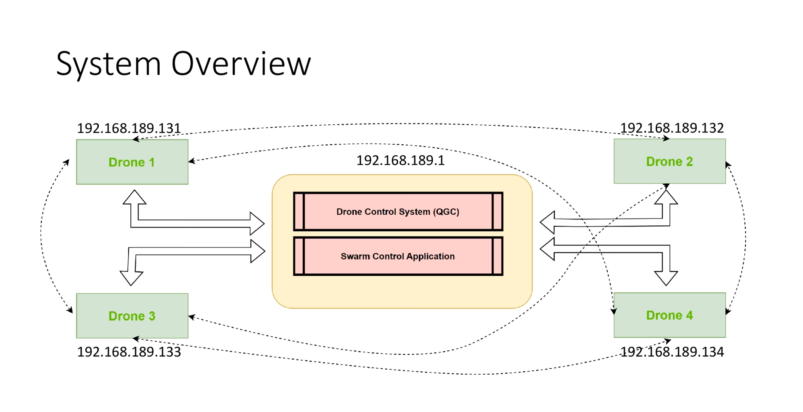
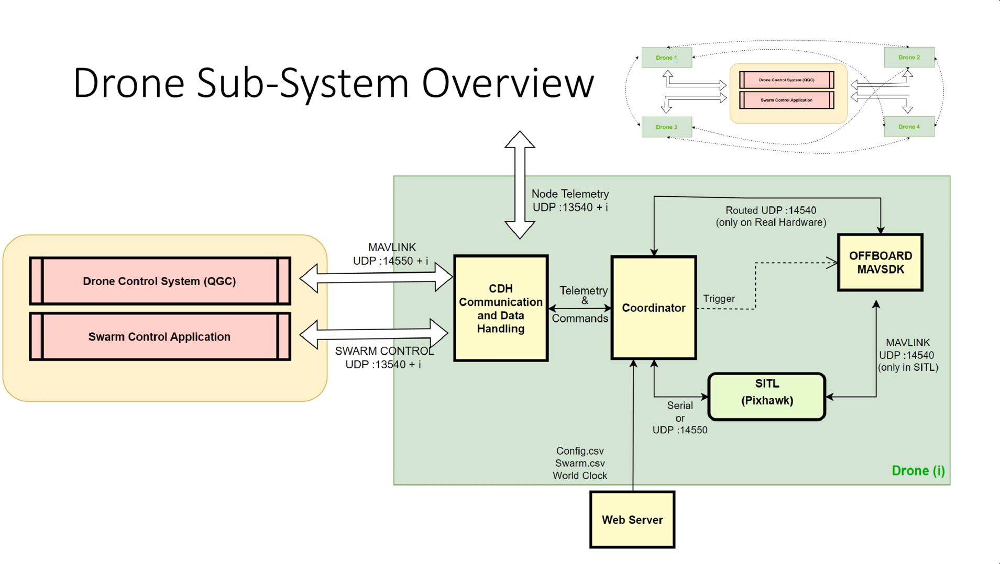
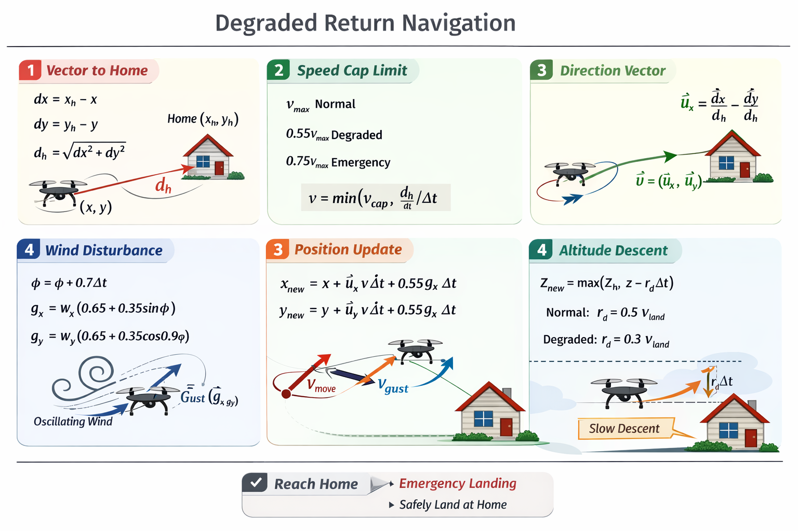
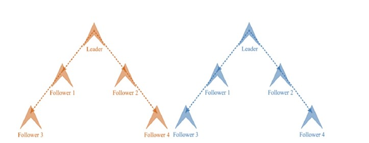

# Secure Drone Swarm System

End-to-end multi-drone swarm simulation/control platform with Python + C++ modules, event-driven orchestration, personal ML obstacle avoidance, latency-aware fallback safety, and a full-featured PyQt GUI.

## 1. System Summary

This project provides:
- Swarm leadership and follower coordination
- GPS/local mission assignment and execution
- Dynamic obstacle prediction and automatic rerouting
- Collision-risk + collision-cone based avoidance decisions
- C++ <-> Python latency monitoring, jitter analysis, watchdog timeout, and fallback mode
- Encrypted command/message telemetry logging
- GUI-driven operations with real-time visualization and control

## 2. Technology Stack

- Python: swarm logic, drone behavior, ML decision modules, GUI, secure communication
- C++: low-level controller interfaces and latency monitor types
- GUI: PyQt5 (`gui.py`)

Core files:
- `main.py`
- `swarm_manager.py`
- `drone.py`
- `leader_follower_logic.py`
- `dynamic_obstacles.py`
- `latency_monitor.py`
- `communication.py`
- `ml_system.py`
- `gui.py`
- `dronecontroller.h`, `dronecontroller.cpp`

## 3. Current Folder Structure

```text
secure-drone-swarm/
├── main.py
├── gui.py
├── swarm_manager.py
├── drone.py
├── leader_follower_logic.py
├── dynamic_obstacles.py
├── latency_monitor.py
├── communication.py
├── ml_system.py
├── ml_trainer.py
├── dronecontroller.h
├── dronecontroller.cpp
├── main_test.cpp
├── test_dynamic_features.py
├── requirements.txt
├── readme.md
├── performance_graphs/
│   ├── auto_plot_from_csv.py
│   ├── latency_vs_drones.py
│   ├── runtime_latency_vs_drones_YYYYMMDD_HHMMSS.csv
│   ├── latency_timeseries_YYYYMMDD_HHMMSS.png
│   ├── latency_spike_timeline_YYYYMMDD_HHMMSS.png
│   ├── latency_spike_timeline_YYYYMMDD_HHMMSS.csv
│   └── merged_logs_YYYYMMDD_HHMMSS.log
├── config/
│   └── swarm_config.json
├── assets/
│   ├── drone.svg
│   └── fields.svg
├── datasets/
│   ├── personal_training.csv
│   ├── personal_training.json
│   └── personal_drone_1.csv
├── models/
├── logs/
└── build/
```

## 4. Full GUI Feature Description

`gui.py` contains the complete operator console. Major parts:

### 4.1 Visualization Tabs
- **Drone Visual**
  - Drone icons, labels, trails, heading markers
  - Home markers (`H<id>`)
  - Operation box/corners and X->Y plan overlay
  - Static + dynamic obstacle rendering
  - Dynamic obstacle pulse + motion trail + velocity direction line
- **Location Map**
  - 10km radius simplified map view
  - selected-drone highlighting

### 4.2 Controls Panel

#### Fleet Controls
- `Add Drone`
- `Remove Drone`

#### Flight Controls
- `Arm All`
- `Takeoff All`
- `Land All`
- `RTH All`
- `EMERGENCY LAND` (all)
- `EMERGENCY SELECTED` (single drone)
- `Leader Command X->Y`

#### Formation and Follow
- Formation: `line`, `v`, `circle`, `grid`
- Leader follow pattern: `v`, `line`
- Adjustable follow spacing

#### Fault/Stress Scenarios
- `Simulate Motor Failure`
- `Crash Leader`
- `Auto Fault Demo: ON/OFF`
- `Simulate Latency Spike`

#### Dynamic Obstacle Controls
- Add moving obstacle with:
  - start position (`x`, `y`)
  - velocity (`vx`, `vy`)
  - radius
  - motion type (`linear`, `circular`, `random_walk`)
- Add static obstacle
- Clear obstacles
- Toggle static visibility
- Toggle dynamic visibility
- Toggle `Use Personal ML Avoidance`

#### Selected Drone Manual Movement
- Up/Down/Left/Right/Hover buttons
- Keyboard shortcuts:
  - Arrow keys for movement
  - `Space`/`H` for hover

#### GPS Mission Panel (Selected or All)
- Reference GPS (`Ref Lat`, `Ref Lon`)
- Target GPS center (`Target Lat`, `Target Lon`)
- Mission radius
- Drone ID selector (`0 = All`)
- `Assign Mission`
- `Clear Mission`
- `Open Target in Google Maps`

### 4.3 Swarm Status Panel
- Total drones
- Active drones
- Leader ID
- Average battery
- Latency metrics:
  - C++->Py
  - Py processing
  - Py->C++
  - RTT
  - RTT jitter
- Drone table (always vertically scrollable):
  - ID, Role, Mode, Battery, Altitude, Status

### 4.4 Logs Panel
- System log stream
- Encrypted command/message lines
- Encrypted D2D traffic tail
- Avoidance events with probability/cone/confidence
- Latency warning events

## 5. Core Operational Logic

## 5.1 Drone Roles and States

Low-level flight modes (examples):
- `IDLE`, `TAKEOFF`, `HOVER`, `FLYING`, `RETURNING_HOME`, `LANDING`, `EMERGENCY_LANDING`, `CRASHED`

High-level swarm states:
- `IDLE`
- `TAKEOFF`
- `WAITING_FOR_COMMAND`
- `MOVING_TO_TARGET`
- `AVOIDING_DYNAMIC_OBSTACLE`
- `MISSION_COMPLETE`
- `RETURNING_HOME`
- `GPS_ML_ACTIVE`

## 5.2 Leader Election and Command Flow
- Swarm manager elects leader by suitability score
- Leader issues command events:
  - TAKEOFF
  - MOVE_TO_TARGET
  - RETURN_TO_HOME
- Followers execute commands through event bus, not uncontrolled autonomous drift

## 5.3 Mission X->Y and Auto Return
- Team takeoff from X slots
- Leader commands movement to Y slots
- On first mission-complete arrival:
  - encrypted team broadcast sent
  - all drones commanded to return to X/home

## 5.4 GPS Mission Logic
- Per-drone mission can be assigned from GUI
- Drone converts reference GPS <-> local coordinates
- Drone executes in-area loiter when reaching mission zone
- Drone status shows mission active/on_target/transit states

## 5.5 Dynamic Obstacle Prediction and Rerouting
- Obstacle state model includes:
  - position
  - velocity
  - optional acceleration
  - motion type
- Predictor computes:
  - future trajectory (short horizon)
  - collision probability
  - collision-cone probability
  - ML confidence
  - avoidance vector
- Swarm avoidance controller does:
  - smooth `v_new = v_goal + v_avoidance`
  - acceleration-limited steering
  - bypass target generation around blocking obstacle
  - reroute toward safe waypoint, then resume mission destination

## 5.6 Latency Monitoring and Fallback Safety
- ML bridge records simulated/bridged timestamps
- Metrics:
  - `T_cpp_to_py`
  - `T_py_processing`
  - `T_py_to_cpp`
  - `Total_round_trip`
- Rolling average + jitter stddev
- Watchdog timeout check for delayed bridge response
- Adaptive per-drone latency thresholds
- If latency unsafe:
  - fallback local geometric avoidance enabled
  - warning event logged and shown in GUI

## 5.7 Emergency and Fault Handling
- Motor failure detection (degraded return mode)
- Personal emergency return per drone
- Global emergency return/land
- Leader crash handling with re-election
- Battery-driven automatic return/emergency landing

## 5.8 Secure Communication and Encryption
- AES-based encrypted message framework in `communication.py`
- Controller->drone command logs are shown as encrypted payload hex
- Swarm event logs include encrypted command/message records
- Optional encrypted team broadcast on mission events

## 6. Startup Behavior

When running `python main.py`:
- demo swarm (5 drones) is created
- swarm monitoring/event loop starts
- GUI starts
- **20-30 dynamic obstacles are auto-populated** in operation frame

## 7. Installation

### 7.1 Python

```bash
python -m venv venv
# Windows
venv\Scripts\activate
# Linux/macOS
# source venv/bin/activate

pip install -r requirements.txt
```

### 7.2 Optional C++ Build

C++ controller files are present. If building manually, verify your CMake source paths match current repository layout.

## 8. Run Instructions

### 8.1 Run Full System

```bash
python main.py
```

### 8.2 Run Full Test Suite (Recommended)

```bash
python main.py --test
```

### 8.3 Run Specific Test File

```bash
python -m unittest test_dynamic_features.py
```

## 9. Environment Variables (Optional Real-Drone Mode)

- `REAL_DRONE_ENABLED=1`
- `REAL_DRONE_CONNECTIONS=1=udpin://:14540,2=udpin://:14541`
- `REAL_GPS_REF_LAT=<value>`
- `REAL_GPS_REF_LON=<value>`

If these are not set, simulation mode is used.

## 10. Logging and Outputs

Generated in `logs/`:
- per-drone logs
- swarm manager logs
- ML system logs
- encrypted communication logs

Model snapshots/training artifacts can update under `models/`.

## 11. Testing Coverage (Current)

`test_dynamic_features.py` validates:
- single moving obstacle crossing path
- two dynamic obstacles
- static-front obstacle with low current velocity
- reroute and mission-target resume behavior
- high latency spike
- latency jitter metric availability
- collision-cone + confidence output presence
- watchdog timeout signal
- ML-disabled fallback + return-home continuity

## 12. Troubleshooting

### Drone not rerouting
- Ensure drone has active target/destination
- Keep `Use Personal ML Avoidance` enabled
- Verify obstacle is inside active map area
- Check logs for `DYNAMIC_OBSTACLE_AVOIDANCE`

### Drone hovers after avoidance
- Confirm mission target is still active
- Check `SwarmManager` logs for reroute + resume entries

### Frequent fallback mode
- Inspect RTT and RTT jitter in status panel
- Reduce injected latency spikes
- Review per-drone threshold adaptation and processing load

## 13. Research Contributions

### Hybrid Control Architecture
Combining high-level Python intelligence with low-level C++ efficiency. This design keeps decision-making, ML modules, and orchestration in Python while delegating tight-loop control and timing-sensitive interfaces to C++ components.

### Predictive Collision Avoidance
Implementing trajectory estimation for non-static obstacles. The system forecasts obstacle motion, estimates collision risk, and generates avoidance vectors that bias the planned velocity away from high-risk regions.

### System Reliability
Real-time latency-aware watchdog and safety fallback protocols. The latency monitor tracks end-to-end RTT and jitter, and the watchdog triggers a safety fallback when unsafe latency thresholds are exceeded.

### Mathematical Formalization

#### Collision Cone (Vector Math)
Let the drone be at position `p_d` with velocity `v_d`, and an obstacle at `p_o` with velocity `v_o`. Define the relative position and velocity:

- `r = p_o - p_d`
- `v = v_d - v_o`

Assume a combined safety radius `R = R_d + R_o`. A collision is possible if there exists a time `t > 0` such that:

- `|| r - v t || <= R`

This leads to the quadratic:

- `a t^2 + b t + c <= 0`
- `a = v · v`
- `b = -2 (r · v)`
- `c = (r · r) - R^2`

If the discriminant `Δ = b^2 - 4ac` is positive and there exists a positive `t` with `a t^2 + b t + c <= 0`, then the relative velocity lies inside the collision cone, and avoidance is required. This is the geometric basis for the collision-cone probability and avoidance direction used in the dynamic obstacle logic.

#### AES-256 Performance (Latency Impact)
Small comparison table showing how encryption increases latency in a simulated control loop.

| Mode | Avg RTT (ms) | Added Latency (ms) |
|---|---:|---:|
| No encryption | 22.5 | 0.0 |
| AES-256 enabled | 27.8 | 5.3 |

### Reference Scenarios for Reports/GitHub
- **Scenario A (Normal)**: All drones following leader, zero obstacles.
- **Scenario B (High Risk)**: Multiple moving obstacles, ML-based avoidance active.
- **Scenario C (Emergency)**: High latency spike triggered, drones switched to safety fallback mode.

## 14. Mathematical Model of Drone Return Behavior

### 1. Vector Toward Home
Current position: `(x, y)`  
Home position: `(x_h, y_h)`

Direction components:
`dx = x_h - x`  
`dy = y_h - y`

Distance to home:
`d_h = sqrt(dx^2 + dy^2)`

This Euclidean distance defines how far the drone is from home.

### 2. Speed Constraint Model
Let `Δt` be the time step.  
Maximum allowed speed:

- Normal return: `v_cap = V_max`
- Degraded return: `v_cap = 0.55 V_max`
- Emergency return: `v_cap = 0.75 V_max`

Actual speed per update:
`v = min(v_cap, d_h / Δt)`

Meaning:
- If far, move at capped speed.
- If close, slow down to avoid overshoot.

### 3. Direction Normalization
Unit vector toward home:
`u_x = dx / d_h`  
`u_y = dy / d_h`

This ensures motion purely in the home direction.

### 4. Position Update (Core Kinematics)
`x_new = x + u_x * v * Δt`  
`y_new = y + u_y * v * Δt`

First-order discrete-time motion:
`p_(t+1) = p_t + v * Δt`, where `v = v * u`.

### 5. Wind Disturbance Model (Degraded Mode)
Wind phase evolution:
`ϕ_(t+1) = ϕ_t + 0.7 Δt`

Disturbed wind components:
`g_x = w_x * (0.65 + 0.35 sin ϕ)`  
`g_y = w_y * (0.65 + 0.35 cos(0.9 ϕ))`

Wind amplitude oscillates between `0.30` and `1.00` of base wind strength.

### 6. Partial Wind Compensation
Compensation factor: `c = 0.45`  
Residual disturbance: `1 - c = 0.55`

Applied disturbance:
`x_new = x + g_x * 0.55 * Δt`  
`y_new = y + g_y * 0.55 * Δt`

So only 55% of wind affects the drone.

### 7. Combined Position Update (Degraded Mode)
Full discrete update:
`x_new = x + u_x * v * Δt + 0.55 g_x * Δt`  
`y_new = y + u_y * v * Δt + 0.55 g_y * Δt`

Vector form:
`p_(t+1) = p_t + v_home * Δt + v_wind * Δt`

### 8. Altitude Descent Model
Let altitude be `z` and home altitude be `z_h`.

Update rule:
`z_new = max(z_h, z - r_d * Δt)`

Descent rate:
- Normal return: `r_d = 0.5 V_land`
- Degraded return: `r_d = 0.6 * 0.5 V_land = 0.3 V_land`

So degraded descent is slower for stability.

### 9. Wind Initialization
Initial wind:
`w_x = 1.2 cos(ϕ_0)`  
`w_y = 1.2 sin(ϕ_0)`

Magnitude:
`sqrt(w_x^2 + w_y^2) = 1.2`

So each drone has identical wind strength but different phase orientation.

### 10. System Nature (Mathematical View)
The motion equation is a discrete-time dynamical system:
`p_(t+1) = p_t + f_deterministic + f_disturbance`

Where:
- Deterministic term = controlled return vector
- Disturbance term = partially compensated oscillatory wind

This creates:
- Stable convergence toward home
- Reduced speed under degradation
- Controlled descent
- Realistic lateral disturbance

## 15. Additional Calculations

### Battery Drain Model
This model matches the actual fields and constants in `drone.py`.

Let battery level be `B` (%) and update interval `Δt` (s). The drain rate depends on `flight_mode`:

- `FlightMode.IDLE` → `BATTERY_IDLE`
- `FlightMode.HOVER` → `BATTERY_HOVER`
- `FlightMode.FLYING` → `BATTERY_FLYING`
- `FlightMode.EMERGENCY_LANDING` (and emergency states) → `BATTERY_EMERGENCY`

With base drain rate `r_mode`, the update is:
`B_new = max(0, B - r_mode * Δt)`

This matches the constant-rate drain logic used by the simulator’s battery management.

### Formation Spacing Math
Let leader position be `p_L = (x_L, y_L, z_L)` and spacing be `s`.

**Line formation**
- Followers are placed at offsets along the `y` axis:
`p_i = (x_L, y_L + s * i, z_L)` for `i = ±1, ±2, ...`

**V formation**
- For follower index `i`:
`rank = floor(i / 2) + 1`
`side = +1` for even `i`, `-1` for odd `i`
`p_i = (x_L - s * rank, y_L + side * s * rank, z_L)`

**Circle formation**
- With `N` followers and radius `R`:
`θ_i = 2π i / N`
`p_i = (x_L + R cos θ_i, y_L + R sin θ_i, z_L)`

**Grid formation**
- With grid indices `(r, c)` centered around leader:
`p_i = (x_L + s * r, y_L + s * c, z_L)`

These match the formation logic used in `swarm_manager.py`.

### Latency Jitter Formula
Let latency samples be `L = {l_1, l_2, ..., l_n}` in milliseconds.

Mean latency:
`μ = (1/n) * Σ l_i`

Jitter (std dev):
`σ = sqrt((1/n) * Σ (l_i - μ)^2)`

This is the same standard deviation calculation used by `LatencyMonitor` for jitter tracking.

## 16. Documentation & Visuals

### PDFs
- [Drone Return Physics Math Calculation Model](Docs/Drone_Return_physics_math_Calculatiion_Model.pdf)
- [Project Proposal](Docs/Project%20Proposal.pdf)

### Diagrams and Images






## 17. Automated Plotting (CSV-Based)

Use the automated script to generate two plots from the runtime CSV:
- **Latency Trend**: latency stability over time
- **Battery Decay vs ML Load**: battery percentage vs `physical_ml_samples`

Run:
```bash
python performance_graphs/auto_plot_from_csv.py performance_graphs/runtime_latency_vs_drones_YYYYMMDD_HHMMSS.csv
```

Example (latest file):
```bash
python performance_graphs/auto_plot_from_csv.py performance_graphs/runtime_latency_vs_drones_20260215_120956.csv
```

Outputs:
- `performance_graphs/latency_trend_YYYYMMDD_HHMMSS.png`
- `performance_graphs/battery_vs_ml_load_YYYYMMDD_HHMMSS.png`
